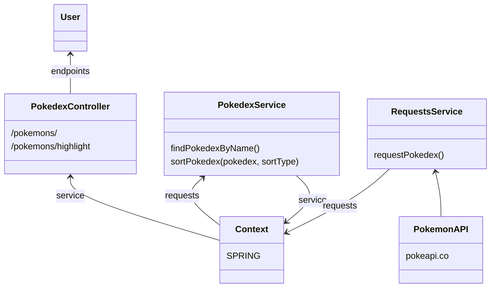

This is a MicroService developed to consume Pokemons from https://pokeapi.co/

Currently, these are the endpoints:

    /pokemons/
    /pokemons/highlight

Within both, two optional parameters are available:

- query: the name/partial name of the Pokémon to be searched
- sort: the type of sort to be used. 

Possible sort values are:
- **name**: sort Pokémon in alphabetical order
- **length**: sort by length of Pokémon name

Information flow works according to the following diagram:

